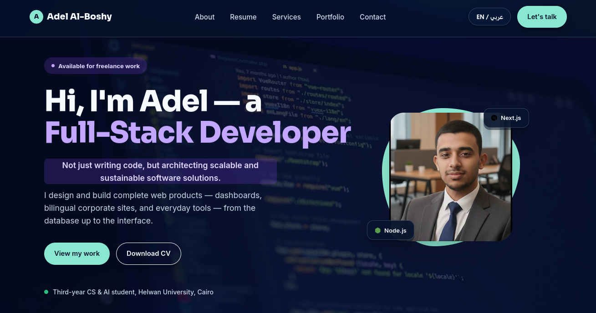

  

  <h1>👋 مرحبًا، أنا عادل أحمد البوشي</h1>
  <h3>Full-Stack Software Engineer | CS Student at Helwan University</h3>

  
طالب بالسنة الرابعة بكلية الحاسبات والذكاء الاصطناعي - جامعة حلوان. مهندس برمجيات متكامل (Full-Stack Developer) يجمع بين البناء الفني الصلب للتطبيقات ومهارات حل المشكلات والتفكير التحليلي.

  

    
    
    
  

  
<a href="https://adel307.github.io/portfulio/"><strong>🌐 Live Demo</strong></a>

---

## 🎓 الخلفية الأكاديمية (Academic Background)

- 🏫 **الكلية:** الحاسبات والذكاء الاصطناعي - جامعة حلوان.
- 🎓 **السنة الدراسية:** الفرقة الرابعة (سنة التخرج).
- 📚 **التركيز الأكاديمي:** دراسة متعمقة لـ Data Structures, Algorithms, System Design، وSystem Architecture.

---

## 🧩 مهارات حل المشكلات والتصميم (Problem Solving & Engineering Skills)

- 🧠 **Problem Solving & Algorithms:** امتلاك تفكير تحليلي قوي ونمذجة للمشكلات البرمجية، مع دراسة وتطبيق متقدم لخوارزميات البحث والفرز والتحسين (Advanced Algorithms & Data Structures).
- 📐 **Professional System Architecture & Design:** القدرة على تخطيط وتصميم المشاريع البرمجية من الصفر بطريقة احترافية (Scalable Architecture) تشمل هيكلة قواعد البيانات وتصميم المكونات المستقلة.
- 🔄 **Clean Code & Software Principles:** الالتزام بكتابة كود نظيف، قابل للصيانة وإعادة الاستخدام، مع مراعاة مبادئ SOLID وOOP.

---

## 🤝 المهارات الشخصية وبيئة العمل (Soft Skills & Professional Competencies)

- 🗣 **التواصل الفعال (Effective Communication):** القدرة على شرح المفاهيم التقنية المعقدة وتبسيطها لفرق العمل وأصحاب العمل.
- 👥 **العمل الجماعي (Teamwork & Collaboration):** خبرة في العمل ضمن فريق، مشاركة الأفكار، والتكامل باستخدام أدوات إدارة النسخ مثل Git وGitHub.
- ⏱ **إدارة الوقت والمشاريع (Time Management & Ownership):** تنظيم مهام التطبيق، الالتزام بالمواعيد النهائية (Deadlines)، وتحمل المسؤولية الكاملة عن جودة المخرجات.
- 💡 **التكيف والتعلم المستمر (Adaptability & Fast Learner):** القدرة على استيعاب التقنيات الجديدة ومواكبة متطلبات السوق بسرعة ودقة.

---

## 🛠 المهارات التقنية (Technical Stack)

### Frontend Development

### Backend Development

### Databases & Tools

---

## 📌 أبرز المشاريع (Featured Projects)

| اسم المشروع | التقنيات المستخدمة | الوصف والتصميم | الرابط |
| :--- | :--- | :--- | :---: |
| **AqarTech** | `Next.js` `Node.js` `MongoDB` | لوحة تحكم لإدارة العقارات تجمع بيانات العمليات في واجهة منظمة وسريعة الاستجابة. | [Live Demo](https://adel307.github.io/portfulio/) |
| **Paylio Payment System** | `Django` `Python` `MySQL` | نظام دفع متكامل يوفّر إدارة آمنة للأموال ولوحة تحكم للمستخدمين وواجهة إدارية للعمليات. | [Code](https://github.com/Islam412/Payment-system) |

---

## 📊 إحصائيات GitHub (GitHub Stats)

  
  

---

  تم التطوير بواسطة <b>عادل أحمد البوشي</b> • يسعدني دائماً التواصل معك!

