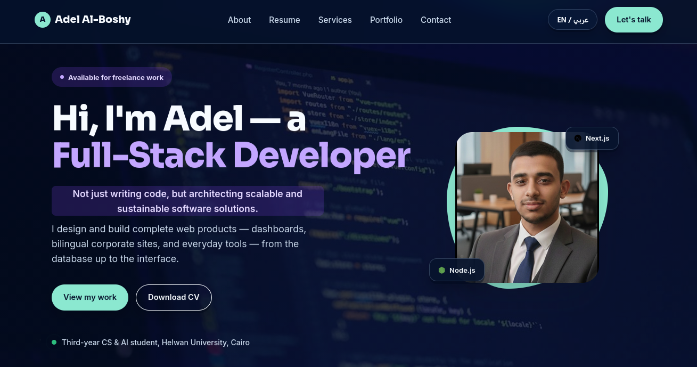

  

  <h1>👋 مرحبًا، أنا عادل أحمد البوشي</h1>
  <h3>Full-Stack Developer | CS & AI Student at Helwan University</h3>

  
طالب بالسنة الرابعة بكلية الحاسبات والذكاء الاصطناعي - جامعة حلوان. مطور برمجيات متكامل (Full-Stack Developer) متخصص في بناء وتصميم حلول برمجية متكاملة وقابلة للتوسع؛ بدءًا من قواعد البيانات وحتى واجهات المستخدم، مع دعم تطبيقات الذكاء الاصطناعي وتعدد اللغات (العربية والإنجليزية).

  

    
    
    
    
  

  
<a href="https://adel307.github.io/portfulio/"><strong>🌐 المعرض الشخصي (Live Demo)</strong></a>

---

## 🎓 الخلفية الأكاديمية (Academic Background)

- 🏫 **الكلية:** الحاسبات والذكاء الاصطناعي - جامعة حلوان، القاهرة.
- 🎓 **السنة الدراسية:** الفرقة الرابعة (سنة التخرج).
- 📚 **التركيز الأكاديمي والعملي:** تصميم وبناء تطبيقات إنتاجية متكاملة (End-to-End)، هندسة البرمجيات القابلة للتوسع (Scalable Architecture)، وتكامل وكلاء الذكاء الاصطناعي (AI Agents).

---

## ⚙️ الخدمات والحلول البرمجية (Services)

- 💻 **تطبيقات ويب متكاملة (Full-stack Web Apps):** بناء متكامل (قواعد البيانات، واجهات برمجية APIs، وواجهات الاستخدام) للمنتجات التي تعتمد على بيانات حقيقية وديناميكية.
- 🤖 **بناء وكلاء الذكاء الاصطناعي (Building AI Agents):** تطوير حلول ووكلاء أذكياء لتمتة مسارات العمل المعقدة، معالجة الأوامر الصوتية والنصية، وتسهيل العمليات اليومية.
- 📊 **لوحات التحكم (Admin Dashboards):** أدوات وأنظمة داخلية لإدارة العقارات، المستأجرين، العقود، أو المعاملات المالية والموردين من مكان واحد.
- 🌐 **المواقع التعريفية والشركات (Corporate & Portfolio Sites):** إنشاء مواقع احترافية للشركات ثنائية اللغة (EN/AR) تدعم RTL وتوفر واجهات تفاعلية لبناء الثقة مع العملاء.

---

## 🛠 المهارات التقنية (Technical Stack)

### Frontend Development

### Backend Development

### Databases

### AI Integration & Agents
- **LLM Integration & Prompting:** ربط وتكامل النماذج اللغوية وهندسة الأوامر.
- **AI API Communication:** التكامل مع واجهات OpenAI وClaude.
- **AI Agents & Workflows:** تطوير وكلاء ذكاء اصطناعي وأتمتة مسارات العمل.
- **Model Context Protocol (MCP):** تطبيق بروتوكول سياق النموذج للتفاعل مع الأدوات.

---

## 📌 أبرز المشاريع (Featured Projects)

| اسم المشروع | التقنيات المستخدمة | الوصف | الرابط |
| :--- | :--- | :--- | :---: |
| **REC Company System** | `Next.js` `Tailwind` `Express` `PostgreSQL` | نظام مركزي لإدارة شركات العقارات والمقاولات والأنشطة المالية والموردين، مدعوم بـ مساعد ذكاء اصطناعي يستوعب الأوامر النصية والصوتية باللغة العربية. | [Live Demo](https://properties-company-system-frontend-one.vercel.app/) |
| **ZEYOTI** | `Next.js` `Tailwind` `Django` `FastAPI` | موقع شركة موزع سيارات ثنائي اللغة (EN/AR) مع دعم كامل لـ RTL ومركز تحميل للموارد. | [Live Demo](https://zeyoti.vercel.app/en) |
| **Paylio Payment System** | `Django` `FastAPI` `HTML/CSS` `JS` | نظام دفع إلكتروني متكامل يتيح إدارة الأموال، المصادقة الآمنة، ولوحة تحكم إدارية. | [GitHub Code](https://github.com/Islam412/Payment-system) |
| **Naharco International** | `HTML5` `CSS3` `JavaScript` | موقع شركة ثنائي اللغة يعرض الخدمات والمدونة وبيانات التواصل. | [Live Demo](https://adel307.github.io/naharco-alduwlya-company/) |

---

## 📊 إحصائيات GitHub (GitHub Stats)

  
  

---

  تم التحديث والتطوير بواسطة <b>عادل أحمد البوشي</b> • يسعدني دائماً التواصل معك!

